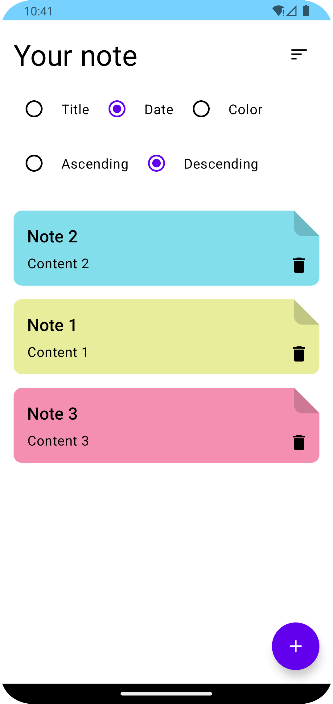
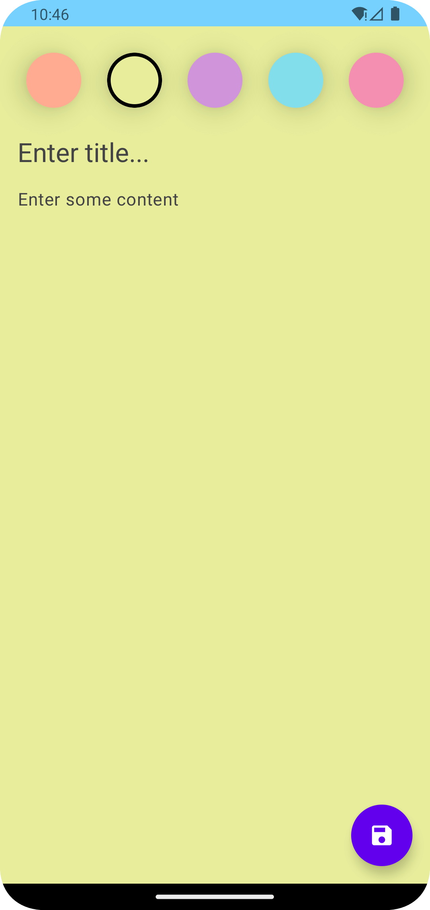

# CLEAN NOTES ANDROID APP
> This repository is originally written by [Philipp Lackner](https://github.com/philipplackner), it is just a [clone](https://github.com/philipplackner/CleanArchitectureNoteApp), having latest configurations and tweaks.

The repository is intended to give a brief idea of Clean Architecture (incl. the Domain layer) along with other Android advanced components as mentioned below:
- MVVM
- Jetpack Compose (UI, Navigation, State, Side-Effects)
- Hilt
- Coroutine + Flow
- Room
- Kotlin (Sealed classes, operator function)

## Modules
I have converted the **domain**, **data**, and **app (presentation)** layers into modules, you can find a brief description of these modules below:
 - **common**: Module contains the common resources used in the layers.
 - **domain**: Module contains an abstraction of the application e.g. repository, model, use cases, etc.
 - **data**: Module contains business logic or implementation of domain layer, e.g., RepositoryImpl, UseCasesImpl, DataSource (DB), etc.
 - **app**: Module contains presentation (UI) logic which is written in Kotlin using Jetpack Compose, and it consults the domain to call its use cases via ViewModels, and the domain consults data to help fetch data.

## Screenshots
 &nbsp;&nbsp;&nbsp;&nbsp; 
